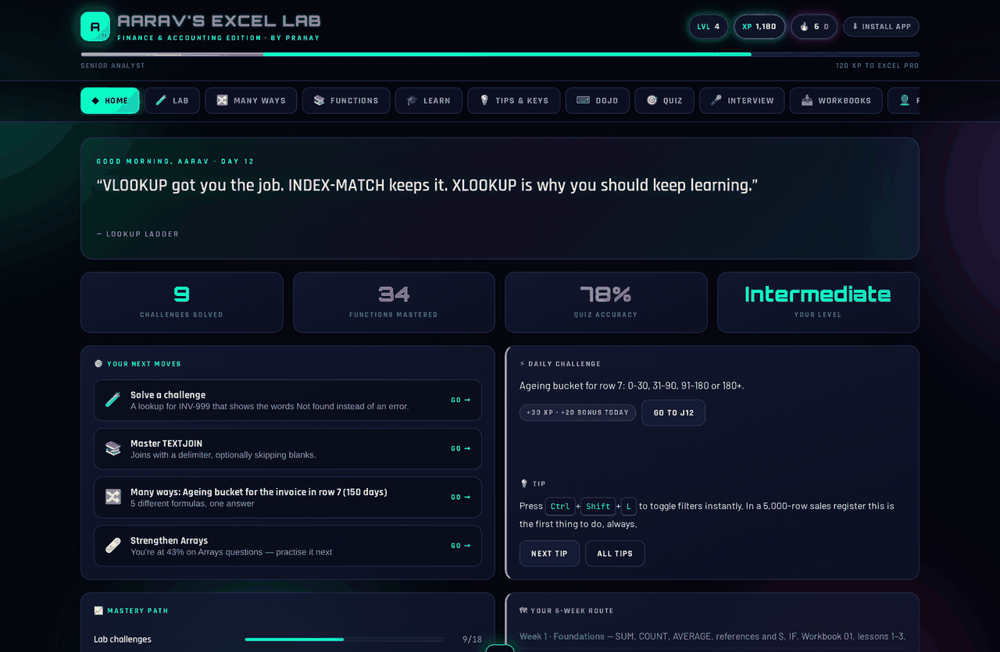
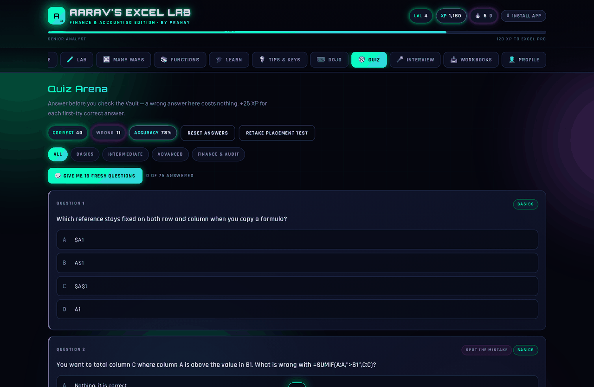
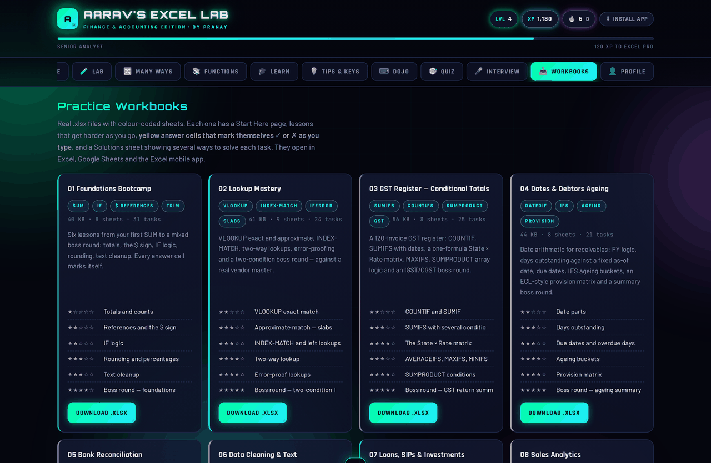
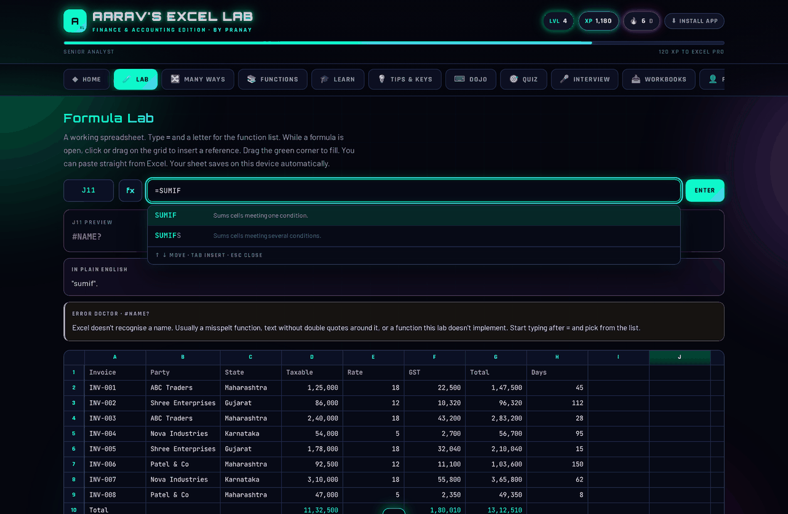
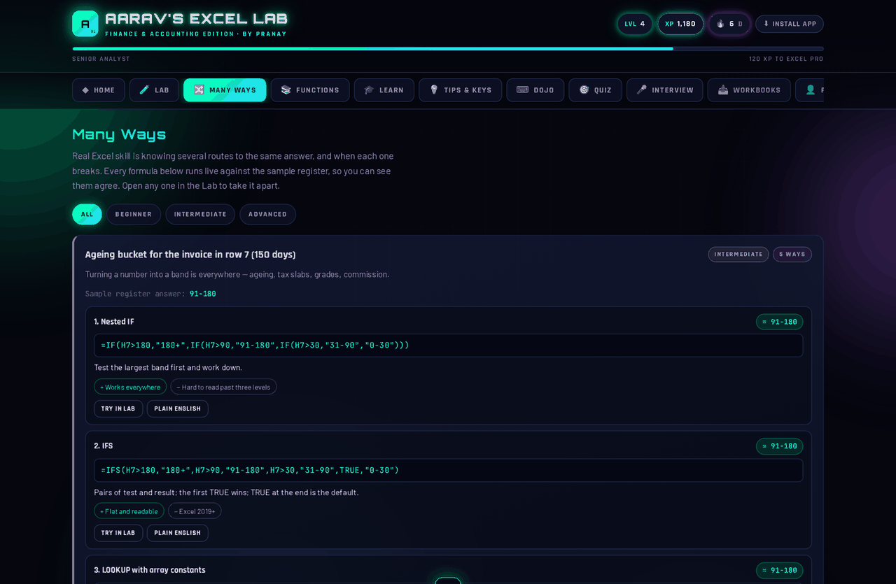
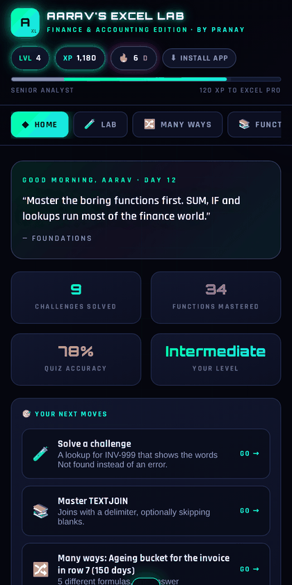
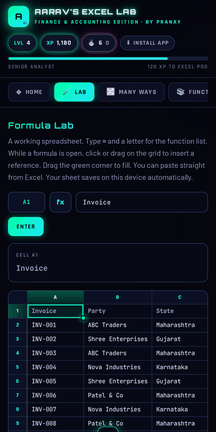

<div align="center">

# Excel Lab

### Learn Excel by actually doing it.

**[▶ Open the live app](https://excel-lab-by-pranay.vercel.app)** — free, no sign-up, works offline

[](https://excel-lab-by-pranay.vercel.app)




</div>

---

Most Excel tutorials show you a formula. You nod, close the tab, and cannot write it the
next day. **Excel Lab makes you type it.**

There is a real spreadsheet on the page with 115 working Excel functions behind it. You
write `=SUMIFS(...)`, it calculates, and it translates back into plain English what you
just asked it to do. When you get it wrong, it says why. Then there are eight practice
workbooks with **262 answer cells that mark themselves ✓ or ✗ as you type**, so you can
practise in real Excel without anyone checking your work.

It is one HTML file. No build step, no server, no database, no dependencies, no account,
no tracking. Everything a learner does stays in their own browser.

## What's inside

| | Station | What it does |
|:--:|---|---|
| 🧪 | **Formula Lab** | A working spreadsheet: formula-bar autocomplete, syntax hints while you type, drag-to-select references, the Excel fill handle with series detection, undo/redo, and copy-paste to and from real Excel |
| 🔀 | **Many Ways** | 14 problems, 62 different formulas — the same answer reached five ways, so you build logic instead of memorising |
| 📚 | **Function Vault** | 97 functions, each with a finance or audit example, where you will actually use it, and the mistake everyone makes |
| 📥 | **Practice Workbooks** | 8 colour-coded `.xlsx` files · 48 lessons · **262 self-marking tasks** |
| 🎓 | **Concept Modules** | 17 modules: plain explanation → technical definition → example → why it matters → interview questions |
| 💡 | **Tips & Shortcuts** | 81 tips and 65 keyboard shortcuts, Windows and Mac |
| ⌨️ | **Shortcut Dojo** | Press the real keys against the clock |
| 🎯 | **Quiz Arena** | 76 questions in five formats, with the reasoning behind every answer |
| ⚡ | **Challenges** | 18 graded tasks checked against the live grid — some ban a function, some require one |
| 🎤 | **Interview Prep** | Answers in Point → Explanation → Example → Conclusion, with the cross-questions that follow |

## No two people get the same app

Excel Lab seeds a private random stream from an id generated in the learner's own
browser, so:

- **The quiz is different for everyone.** Question order and answer options are shuffled per learner and reshuffle every week — nobody can memorise "the answer is always C", and two students comparing screens see different papers.
- **The placement test is drawn, not fixed.** Ten questions pulled from a pool of 28, balanced 3 basic / 4 intermediate / 3 advanced. Retake it and you get a different test.
- **The app starts where you are.** That placement result sets your level, and the dashboard, challenges and quiz all open at it.
- **It tracks what you're weak at.** Every quiz answer and challenge feeds a nine-area skill map, and the app keeps steering you back to your worst area.

It is all deterministic from the seed, so a half-finished quiz never reshuffles underneath you.

<div align="center">



*Five question formats — predict the result, spot the mistake, which function, true or false, and plain multiple choice*

</div>

## The practice workbooks

Each workbook opens on a **Start Here** page and runs lessons that get harder as you go
(★ to ★★★★★). Yellow cells are where your formula goes and the **Check** column marks it
the moment you press Enter. Blue cells are inputs — change one and every answer should
move; if it doesn't, your references are wrong. A **Solutions** sheet gives the model
answer *and* other valid ways to reach it.

| # | Workbook | Covers | Tasks |
|:--:|---|---|:--:|
| 01 | Foundations Bootcamp | SUM/COUNT/AVERAGE, the `$` sign, IF logic, rounding, text cleanup | 31 |
| 02 | Lookup Mastery | VLOOKUP exact & approximate, INDEX-MATCH, two-way and two-condition lookups | 24 |
| 03 | GST Register | COUNTIF/SUMIF, SUMIFS, a state × rate matrix from one formula, AVERAGEIFS/MAXIFS | 25 |
| 04 | Dates & Debtors Ageing | Date arithmetic, FY logic, IFS ageing buckets, an ECL-style provision matrix | 21 |
| 05 | Bank Reconciliation | Matching by reference, timing differences, amount errors, a BRS that proves to zero | 36 |
| 06 | Data Cleaning & Text | TRIM/PROPER, splitting codes with FIND/MID, numbers and dates trapped in text, duplicates | 33 |
| 07 | Loans, SIPs & Investments | PMT, a full amortisation schedule, FV/PV/NPER/RATE, NPV/IRR, XIRR, prepay-vs-invest | 48 |
| 08 | Sales Analytics | Revenue by segment, month × region matrix, rep scorecard, Pareto, running totals | 44 |

Every model answer is **machine-verified**: each workbook is built twice and recalculated
in LibreOffice — a blank copy that must show ◯ on every task, and a fully answered copy
that must show ✓ on every task. Current score: **262/262, zero errors.**

<div align="center">



</div>

## The Formula Lab

<div align="center">



</div>

The spreadsheet is not an embed or an iframe — it is a formula engine written from
scratch: a tokenizer, a recursive-descent parser with Excel's real operator precedence,
and an evaluator with array broadcasting, lazy arguments (so `IF` only evaluates the
branch it takes), error propagation and circular-reference detection.

That is what makes the teaching possible. Because the app *understands* your formula
rather than just running it, it can translate it back into English, show the value of
each nested step, and diagnose an error instead of printing `#VALUE!` and shrugging.

<div align="center">



*The same problem solved several ways, each with a live result*

</div>

## On a phone

<div align="center">

&nbsp;&nbsp;

</div>

The grid is fully usable on mobile. While a formula is open the grid switches into
range-pick mode, so dragging a finger across cells drops `B2:D5` into the formula instead
of scrolling the page. It installs as an app from the browser menu and works with no
connection.

## Run it locally

```bash
git clone https://github.com/PRANAYRAJPUT321/excel-lab.git
cd excel-lab
python3 -m http.server 8000
```

Then open <http://localhost:8000>. That is the entire setup — there is nothing to install.

## Deploy your own

Any static host works. No build command, no output directory, no environment variables.

| Host | How |
|---|---|
| **Vercel** | Import the repo at [vercel.com/new](https://vercel.com/new) |
| **Netlify** | Drag the folder onto [app.netlify.com/drop](https://app.netlify.com/drop) |
| **GitHub Pages** | Settings ▸ Pages ▸ Deploy from branch ▸ `main` ▸ `/ (root)` |
| **Any web host** | Upload the files |

After deploying, set `const SITE_URL=` near the bottom of `index.html` to your address —
it is only used for the certificate footer and the link-preview card. `vercel.json` and
`netlify.toml` force the `.xlsx` files to download rather than open, which is what makes
downloads reliable on phones.

## Files

```
index.html                 the entire application — HTML, CSS and JS in one file
excel-lab-0*.xlsx          8 practice workbooks, 262 self-marking tasks
sw.js                      service worker — offline support
manifest.webmanifest       makes it installable as an app
vercel.json netlify.toml   download headers for the workbooks
_headers                   the same, for hosts that read Netlify's format
icon-192.png icon-512.png og.png    app icons and the link-preview card
docs/                      the screenshots in this README
```

## Built with

Nothing. No framework, no bundler, no `npm install`. Plain HTML, CSS and JavaScript,
deliberately — so it loads instantly on a cheap phone on a slow connection, which is what
most students are actually using.

The workbooks are generated by a Python script using `openpyxl` and verified by
recalculating them in LibreOffice. That build tooling lives outside this repo, which
holds the finished site.

## Contributing

Spotted a wrong explanation, a broken formula or a typo? Open an issue — corrections to
the teaching content are the most useful thing you can send.

## Licence

[MIT](LICENSE) — free for every student to use, fork and share.

---

<div align="center">

Created by **Pranay** · PGDM Finance

**[excel-lab-by-pranay.vercel.app](https://excel-lab-by-pranay.vercel.app)**

</div>
